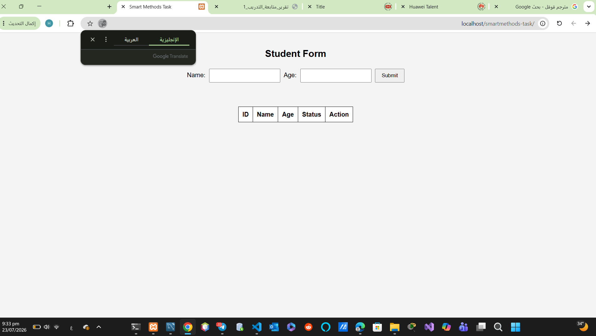

# 🎓 Simple Student Management System using PHP & MySQL

A simple web application developed using **PHP**, **MySQL**, **HTML**, **CSS**, and **JavaScript** to manage student records.

---

## 📌 Features

- ✅ Add a new student
- ✅ Display all students
- ✅ Toggle student status (Active / Inactive)
- ✅ Store data in MySQL database
- ✅ Simple and clean user interface

---

## 🛠️ Technologies Used

- PHP
- MySQL
- HTML5
- CSS3
- JavaScript

---

## 📂 Project Structure

```
Simple-Student-Management-System-using-PHP-and-MySQL/
│
├── index.php
├── insert.php
├── toggle.php
├── db.php
├── style.css
├── script.js
├── preview.png
└── README.md
```

---

## 📸 Screenshot

<p align="center">

</p>

---

## ⚙️ How to Run

1. Install **XAMPP**.
2. Copy the project folder into:

```
xampp/htdocs/
```

3. Start:

- Apache
- MySQL

4. Create a MySQL database named:

```
task_db
```

5. Create the `users` table.

6. Open your browser and visit:

```
http://localhost/smartmethods-task/
```

---

## 👨‍💻 Author

**Hashim Almaramhi**

Artificial Intelligence Student

---

## 📄 License

This project was developed for educational purposes.
